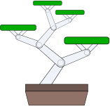

# Bonsamatic

Bonsamatic is a small-size timer plant watering system, devised to keep my bonsai alive and well during travel. 

## Bonsamatic features:

* A good quality Japanese-made membrane pump for reliable water dosage.

* Water-resistant design that let me leave it out on the balcony without worrying about rain. The box, the meter and 12V power plug are sealed, and the top switch is rated for outdoor use.

* A stylish, easy to read analog time meter and tactile analog controls. You can easily set a time from 6 hours to 10 days at the twist of a dial, and see the time left at a glance.

* Custom-designed(1) Arduino breadboard with all electroncis for control, the UI and motor control on a single board. 

* Quality(2) embedded control software that has been tested literally handfuls of times.

* An LED. Every project needs an LED. 

Bonsai need water on a very regular schedule, but don't like being constantly wet. Bonsamatic 1.0 relies on a timer for watering, rather than a moisture sensor. This works fine for a period of a week or two. If you want a water system that can work indefinitely you need to measure the soil moisture content. A proper moisture sensor and a wifi connection is on the to-do list, but it is quite difficult to make a good, reliable moisture sensor so it will not happen in the near term.

The most interesting part of this project is perhaps not the water system itself, but the time display. The time frame ranges from hours to several days, so a logarithmic scale is all but necessary. However, I use a cheap(3) analog dial, and its voltage response is anything but regular. And as the Atmel AVR pwm has only 8 bit resolution, we need to figure out how to map the display response directly to the scale we want with minimal inaccuracy.

*Software/analogdisplay.py*

This script will figure out the displayed time for each pwm output level given the measured voltage/degree response of the dial and the desired time range. The dial I use has a linear response at 0-20 degrees, and a logarithmic response beyond that so the code reflects this. The script is thus not really a general solution but an example of how to figure this out.

It generates a couple of tables for use in the Arduino sketch, and, if you have "svgwrite" installed, an SVG graphic of the dial scale to print out and use in the dial.The source code is documented and shows how to use the script.

*Bonsamatic/Bonsamatic.ino*

This is the Arduino sketch that runs Bonsamatic. It's a fairly simple event-driven loop that uses the table data generated by analogdisplay above to drive the dial display.

*Doc/bonsa_schem.svg
Doc/bonsa_bom.html
Doc/bonsa.fzz*

This is the schematics for the Bonsamatic hardware, the bill of materials, and the Fritzing design file. Note that these files show generic components, not the exact ones I used, and the analog dial component is badly implemented by myself and won't probably even show up in these files.

If you have any questions or comments, you can contact me at jan.moren@gmail.com

All files are copyright 2014 Jan Moren and licensed under GPL version 3.

_(1) "custom" as in "I made it up as I went along"._

_(2) The word "high" appears nowhere in the vicinity of "quality". This is not an accident._

_(3) I looked for the lowest-cost analog voltage dial at my local electronics store, and yes, you get what you pay for._

